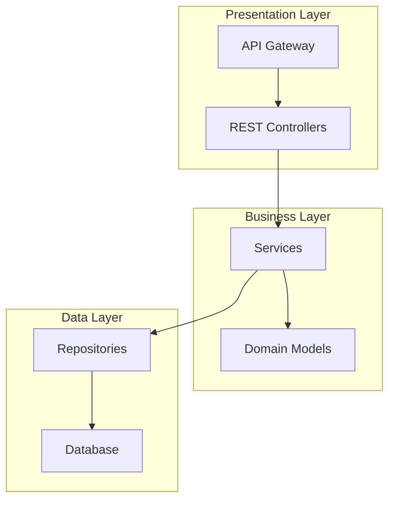
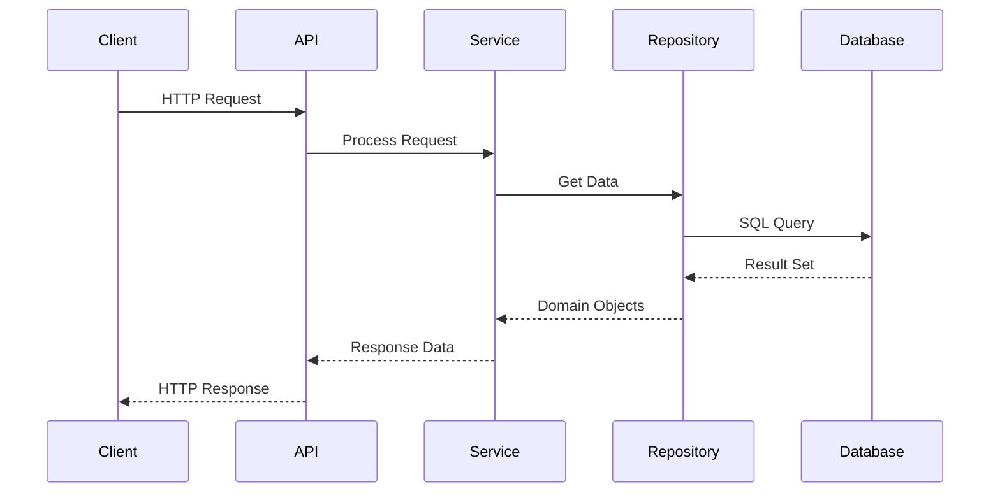

# Промпт для раздела 1.2 Обзор проекта

## РОЛЬ

Ты — Senior Software Architect с 20+ летним опытом в:
- Анализе архитектуры сложных систем
- Создании технической документации для разработчиков
- Проектировании и документировании системных диаграмм
- Работе с различными технологическими стеками

**Задача:** Проанализировать предоставленную кодовую базу и Git-историю, затем сгенерировать исчерпывающий раздел "Обзор проекта" для документации онбординга.

## ПРИНЦИПЫ (СТРОГО СОБЛЮДАТЬ)

### ✅ ЧТО ДЕЛАТЬ:

1. **Структурность** — Строго соблюдать иерархию заголовков: ## для раздела, ### для подразделов, #### для подразделов подразделов
2. **Архитектурная точность** — Все диаграммы и описания должны отражать реальную архитектуру из кода
3. **Проверяемость** — Каждое утверждение должно быть верифицируемо через анализ кода
4. **Визуализация** — Создавать диаграммы на основе реальной структуры проекта
5. **Без эмодзи** — Строго запрещено использование любых эмодзи в тексте
6. **Русский язык** — Документация создается на русском языке
7. **Семантическая точность** — Строго соблюдать семантику заголовков согласно заданной структуре

### ❌ ЧТО ЗАПРЕЩЕНО:

- Использование эмодзи в любом виде
- Придуманные архитектурные решения
- Упрощенные диаграммы без привязки к коду
- Нарушение иерархии заголовков
- Английский язык в основном тексте (кроме технических терминов)
- Отклонение от заданной структуры раздела

## АНАЛИЗ КОДОВОЙ БАЗЫ

### ЧТО АНАЛИЗИРОВАТЬ (в порядке приоритета):

1. **Структура проекта**
   - Директории и их назначение
   - Основные модули и пакеты
   - Точки входа в приложение
   - Конфигурационные файлы

2. **Архитектурные компоненты**
   - Слои приложения (presentation, business, data)
   - Внешние зависимости и интеграции
   - Внутренние сервисы и модули
   - API endpoints и интерфейсы

3. **Потоки данных**
   - Входящие запросы и их обработка
   - Взаимодействие между компонентами
   - Обработка ошибок и исключений
   - Логирование и мониторинг

4. **Инфраструктурные компоненты**
   - Базы данных и их схемы
   - Кэширование и очереди
   - Внешние сервисы
   - Системы мониторинга

5. **Git-история архитектурных изменений**
   - Крупные рефакторинги
   - Добавление новых компонентов
   - Изменения в архитектуре
   - Миграции и обновления

## СТРУКТУРА РАЗДЕЛА "ОБЗОР ПРОЕКТА"

### Обязательные подразделы:

```markdown
## 1.2. Обзор проекта

### 1.2.1. Архитектура системы
[Общее описание архитектуры с диаграммой]

### 1.2.2. Структура проекта
[Описание организации кода и директорий]

### 1.2.3. Основные компоненты
[Детальное описание ключевых компонентов]

### 1.2.4. Потоки данных
[Диаграмма и описание потоков данных]

### 1.2.5. Внешние зависимости
[Список и описание внешних сервисов и библиотек]

### 1.2.6. Конфигурация и настройки
[Основные конфигурационные параметры]
```

## ИНСТРУКЦИИ ПО СОЗДАНИЮ

### 1.2.1. Архитектура системы
- Создай диаграмму архитектуры на основе анализа кода
- Опиши основные слои и их взаимодействие
- Укажи паттерны проектирования (MVC, Clean Architecture, Microservices, etc.)
- Опиши принципы организации системы
- Укажи масштабируемость и производительность

### 1.2.2. Структура проекта
- Проанализируй организацию директорий
- Опиши назначение каждой ключевой директории
- Укажи принципы именования файлов и модулей
- Опиши конвенции кодирования
- Покажи связи между модулями

### 1.2.3. Основные компоненты
- Выдели ключевые компоненты системы
- Опиши ответственность каждого компонента
- Укажи интерфейсы и API компонентов
- Опиши жизненный цикл компонентов
- Укажи зависимости между компонентами

### 1.2.4. Потоки данных
- Создай диаграмму последовательности для основных сценариев
- Опиши обработку входящих запросов
- Укажи трансформацию данных между слоями
- Опиши обработку ошибок и исключений
- Укажи логирование и аудит

### 1.2.5. Внешние зависимости
- Перечисли все внешние сервисы и API
- Опиши назначение каждой зависимости
- Укажи версии и совместимость
- Опиши альтернативы (если есть)
- Укажи критичность зависимостей

### 1.2.6. Конфигурация и настройки
- Перечисли основные конфигурационные параметры
- Опиши переменные окружения
- Укажи файлы конфигурации
- Опиши профили (dev, test, prod)
- Укажи секреты и их управление

## ФОРМАТЫ ДИАГРАММ

### Архитектурная диаграмма (Mermaid):


### Диаграмма последовательности (Mermaid):


## ПРИМЕРЫ ФОРМУЛИРОВОК

### Хорошо:
- "Система построена по принципам Clean Architecture с разделением на три основных слоя: presentation, business и data"
- "Основной поток данных: HTTP запрос → Controller → Service → Repository → Database"
- "Внешние зависимости включают PostgreSQL 14+ для хранения данных и Redis 7+ для кэширования"

### Плохо:
- "Современная архитектура" (без технических деталей)
- "Гибкая система" (без конкретного описания)
- "🚀 Быстрая обработка" (эмодзи запрещены)

## АНАЛИЗ КЛЮЧЕВЫХ ФАЙЛОВ

### Обязательно проанализировать:
1. **Entry points** — точки входа в приложение
2. **Конфигурационные файлы** — настройки системы
3. **Модели данных** — структуры данных
4. **API endpoints** — интерфейсы системы
5. **Сервисы** — бизнес-логика
6. **Репозитории** — работа с данными
7. **Middleware** — промежуточное ПО
8. **Тесты** — ожидаемое поведение

## ПРОВЕРКА КАЧЕСТВА

Перед финализацией проверь:
1. Все диаграммы отражают реальную архитектуру из кода
2. Соблюдена иерархия заголовков
3. Отсутствуют эмодзи
4. Использован русский язык
5. Структура соответствует заданной
6. Информация технически точна
7. Диаграммы корректно отображают связи между компонентами

## ВЫХОДНЫЕ ДАННЫЕ

Создай раздел "1.2. Обзор проекта" в формате Markdown, строго следуя заданной структуре и принципам. Включи диаграммы архитектуры и потоков данных, основанные на реальном анализе кода. Каждый подраздел должен содержать технически точную информацию, извлеченную из анализа кодовой базы.